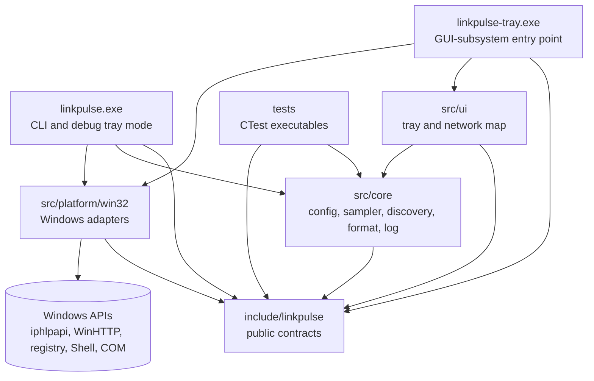
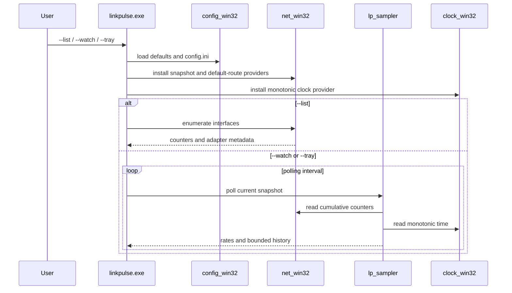
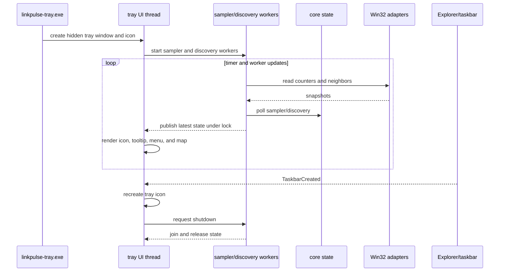
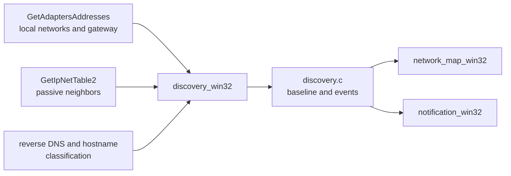
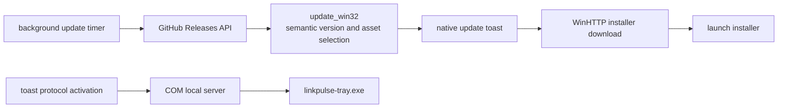

# LinkPulse Architecture

LinkPulse is a Windows 11 tray monitor with a portable C11 core. The core computes state from injected providers; Windows-specific code supplies those providers and owns the UI and operating-system integrations.

## Module Boundaries

The dependency direction is intentional:

- `src/core` must not include Windows headers or call UI code.
- `src/platform/win32` translates Windows APIs into the interfaces declared in `include/linkpulse`.
- `src/ui` owns presentation and consumes snapshots/events from the core.
- Tests inject fake providers into core modules, so rate and discovery behavior does not require a live network.

## CLI Runtime

The sampler works from cumulative byte counters. It computes deltas using monotonic time, handles counter resets and adapter churn, filters loopback/virtual adapters according to configuration, and keeps a fixed-capacity history.

## Tray Runtime

The UI thread owns Windows windows, icons, menus, and message dispatch. Shared sampler/discovery results are protected before the UI reads them. Icon replacement must destroy the previous icon to avoid a GDI leak.

## Discovery and Update Flows

Discovery is passive by default. The core retains a baseline and emits a joined event immediately, but waits `LP_DISCOVERY_MISSING_POLLS_BEFORE_LEFT` polls before declaring a neighbor left. Updates never replace the running executable silently; they download and launch the installer.

## Build and Debugging

The supported native Windows development path is:

1. CMake configures the `msvc` preset with Visual Studio 2022 x64.
2. `msvc-debug` builds PDB-backed Debug binaries and copies the CLI binary to `out/windows`.
3. VS Code uses `cppvsdbg` from the Microsoft C/C++ extension to launch those MSVC binaries.
4. CTest runs the core-focused test executables from the same build tree.

MinGW remains a cross-build option, but it is not required for the primary Windows debugging workflow.
